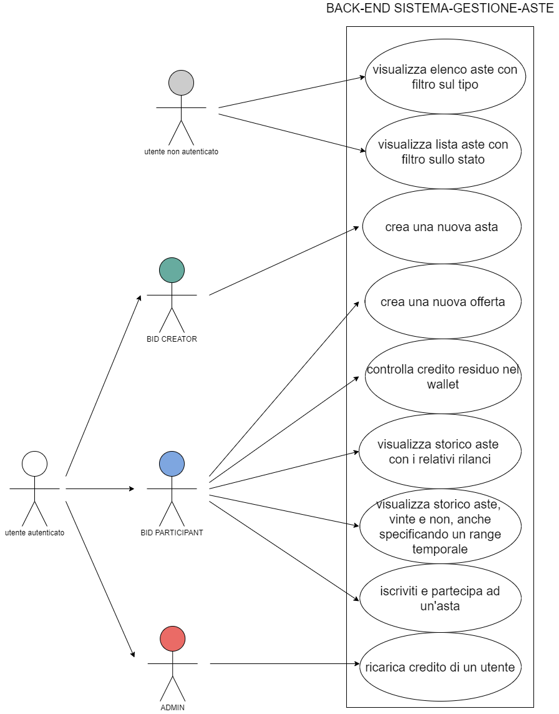
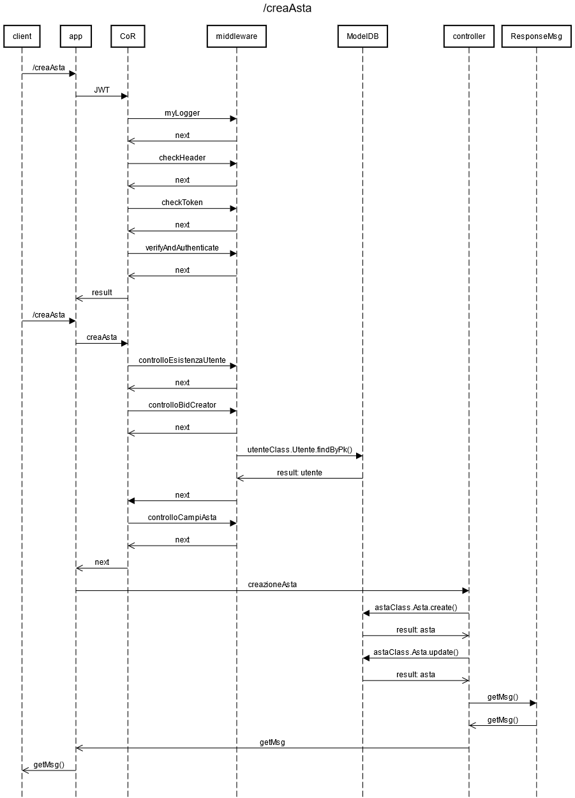
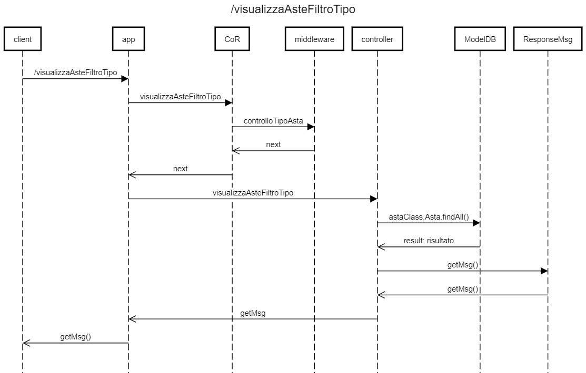
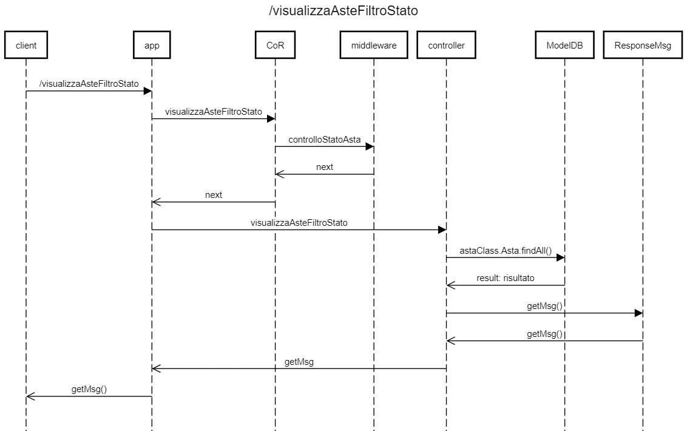
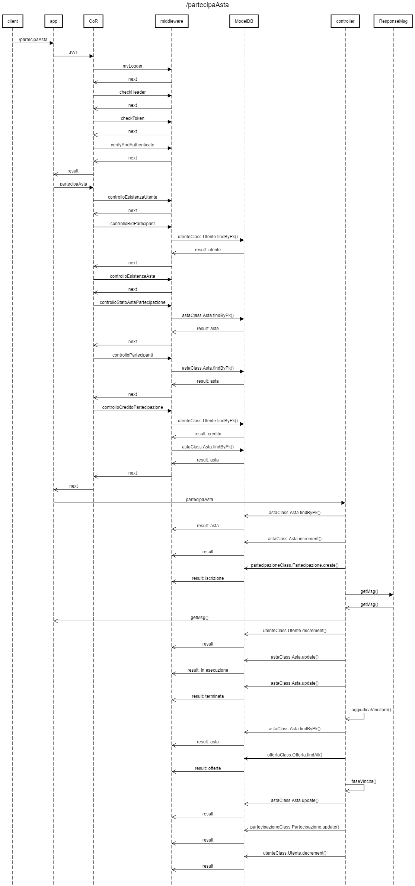
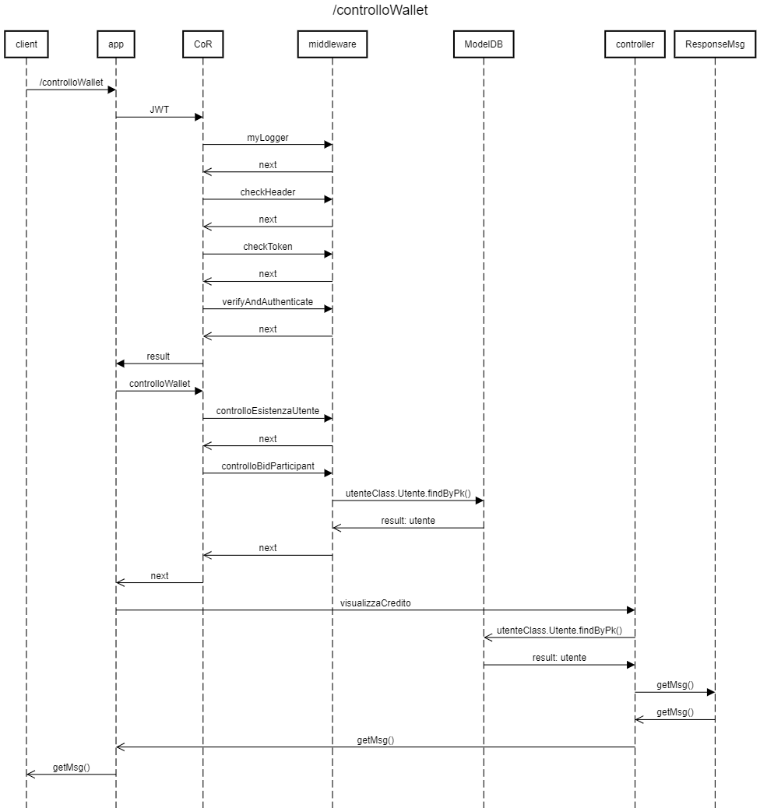
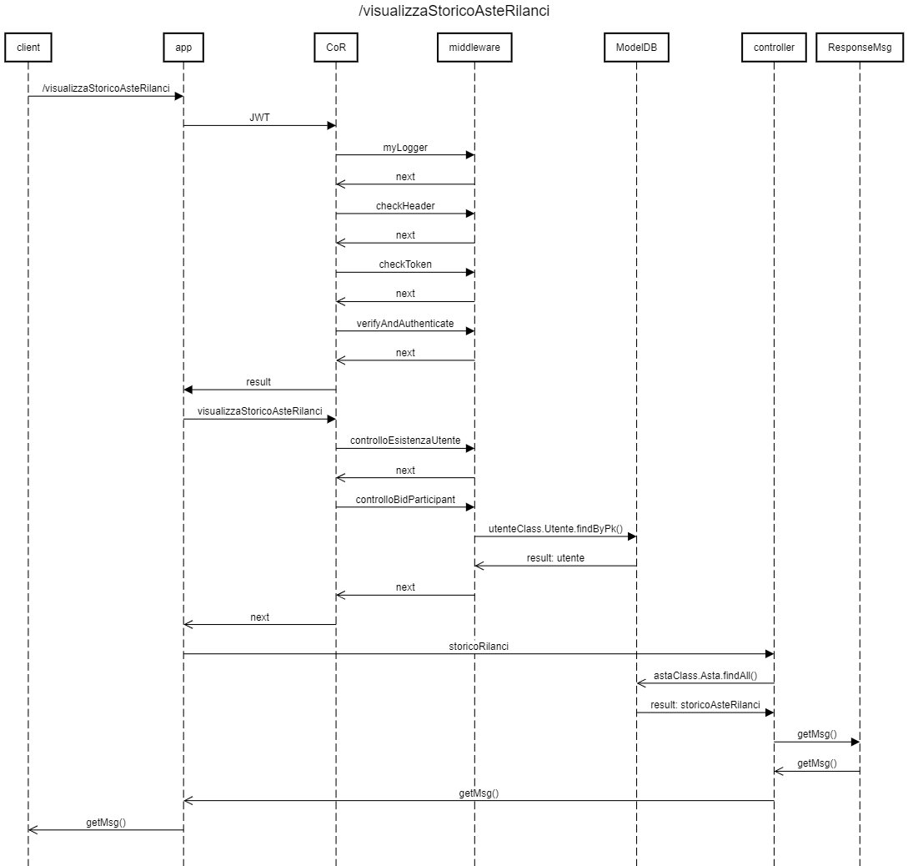
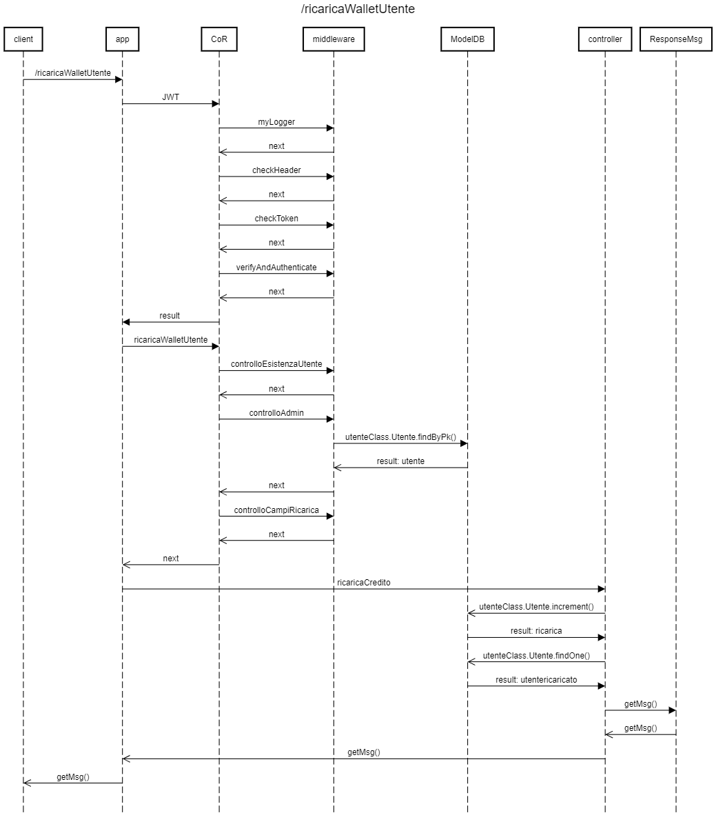
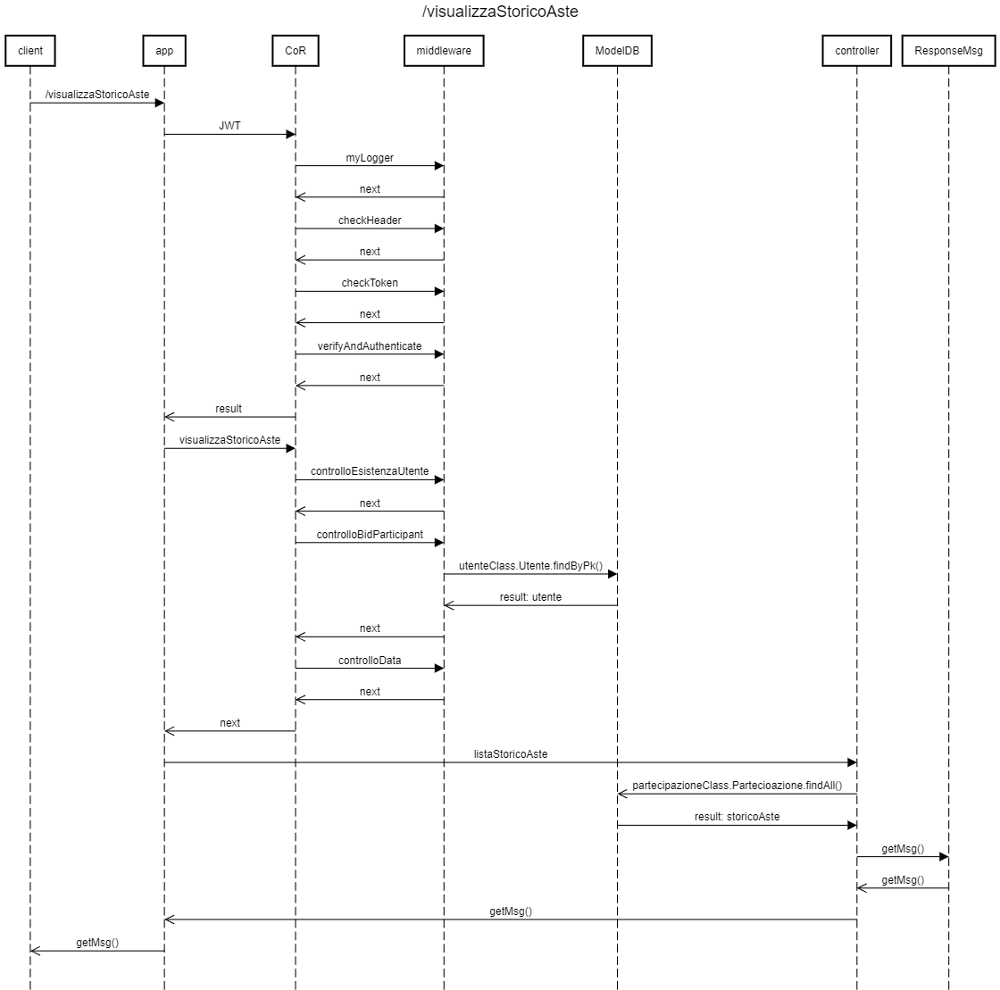
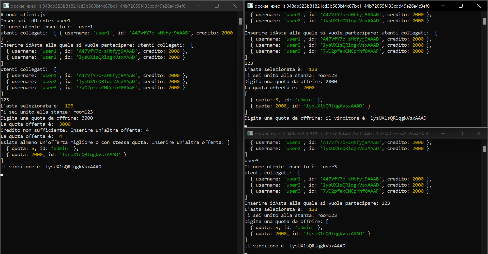

# Progetto di programmazione avanzata: sistema per gestione aste

## Obiettivo del progetto
Realizzazione di un sistema (lato back-end) che consente di gestire delle aste, in particolare tre tipologie di aste:
-asta inglese aperta (“English Auction”): l’asta è di tipo ascendente, cioè vince il prezzo massimo. L’asta inglese,è la più nota forma di asta ed è quella tipicamente utilizzata per le aggiudicazioni di oggetti d’arte. Nell'implementazione del progetto, i concorrenti sono riuniti in una stanza associata all’asta (mediante websocket) e si svolge attraverso un banditore che parte dal più basso prezzo accettabile, detto base d’asta, e che sollecita le offerte al rialzo fino a quando nessuna offerta viene superata da un altro compratore. In questo caso si realizzino anche dei semplici client per simulare un’asta con un numero minimo di partecipanti pari a tre. 
– asta in busta chiusa e pagamento del prezzo più alto (“First Price Sealed Bid Auction”), nella quale gli offerenti inseriscono la loro offerta in una busta sigillata e la consegnano al banditore. Le buste, successivamente, sono aperte e l’individuo con l’offerta più alta vince l’asta, pagando un prezzo pari all’ammontare offerto. La simultaneità temporale non è essenziale, ciò che conta è che quando un offerente formula la propria offerta, entro il termine fissato, non conosca le offerte fatte dagli altri; 
– asta in busta chiusa e pagamento del secondo prezzo più alto (“Second Price Sealed Bid Auction”), nella quale gli offerenti inseriscono la loro offerta in una busta sigillata e la consegnano al banditore. Le buste, successivamente, sono aperte e l’individuo con l’offerta più alta vince l’asta, pagando un prezzo pari al secondo ammontare offerto più alto. Questo tipo di asta viene anche detto “asta di Vickrey”.

L'accesso al sistema avviene tramite autenticazione JWT e ad ogni utente deve essere associato e riconosciuto il proprio ruolo.
Si ammettono tre tipi di utenti: 
* Bid-partecipant: rappresenta l'utente che può partecipare alle aste aperte, effettuare una prima offerta e/o eventualmente rilanci e gestire il proprio "wallet" ossia il credito;
* Bid-creator: rappresenta l'utente che crea l'asta dell'oggetto in vendita e sceglie il tipo di asta;
* Admin: rappresenta l'utente che esegue azioni su richiesta degli altri utenti del sistema.

I token JWT sono stati generati tramite il seguente sito:
* [JWT.io](https://jwt.io/) utilizzando la chiave segreta "chiaveprogettoaste".

Gli obiettivi principali del progetto sono i seguenti:

– creare una nuova asta specificando la tipologia ed i parametri. All'utente sarà consetito di creare l'asta solo se autenticato mediante token JWT con ruolo bid-creator;

– visualizzare l’elenco delle aste filtrando per non ancora aperte, in esecuzione, terminate. Questa tipologia di richiesta non richiede alcun tipo di autenticazione;

– opzionare / creare una nuova offerta per una data asta. Per creare una nuova offerta, l'utente deve necessariamente essere autenticato mediante token JWT con ruolo bid-participant. Inoltre all'utente è permesso di creare una o varie offerte, a seconda del tipo di asta, solo se iscritto all'asta;

– gestire per ogni utente il proprio “wallet” / portafoglio ovvero per ogni utente deve essere gestito il suo credito sotto forma di token. All’atto di un “rilancio” / offerta è necessario verificare la capienza dell’utente; se il credito non è disponibile allora la richiesta viene rifiutata. L'utente può accedere al proprio wallet solo se prima autenticato mediante token JWT con ruolo bid-participant;

– dare la possibilità all’utente di verificare il proprio credito residuo. All'utente è permesso visualizzare il proprio credito residuo solo se prima autenticato mediante token JWT con ruolo bid-participant;

– visualizzare lo storiche delle aste alle quali si è partecipato / si sta partecipando listando tutti gli eventuali rilanci. All'utente è permesso visualizzare lo storico dei rilanci solo se prima autenticato mediante token JWT con ruolo bid-participant;

– all’atto dell'aggiudicazione, scalare il credito all’utente che risulta vincitore secondo la strategia dell’asta alla quale ha partecipato;

– Creare una rotta che consenta ad un utente admin di ricaricare un dato utente. Prima è necessario verificare che la richiesta di ricarica venga da un utente admin, quindi l'utente deve autenticarsi mediante token JWT con ruolo admin;

– visualizzare lo storico delle aste alle quali si è partecipato distinguendo per quelle che sono state aggiudicate e non (l’utente può specificare un range temporale). All'utente è permesso visualizzare lo storico solo se autenticato mediante token JWT con ruolo bid-participant.

## Richieste
Le specifiche richieste per l'implementazione sono:

Tipo          | Rotta                         | Autenticazione JWT   |Ruolo
------------- | ----------------------------- |----------------------|-----------------
Post          | /creaAsta                     | si                   |bid-creator
Get           | /visualizzaAsteFiltroTipo     | no                   | -
Get           | /visualizzaAsteFiltroStato    | no                   | -
Post          | /partecipaAsta                | si                   |bid-participant
Post          | /creaOfferta                  | si                   |bid-partecipant
Get           | /controlloWallet              | si                   |bid-partecipant
Get           | /visualizzaStoricoAsteRilanci | si                   |bid-partecipant
Post          | /ricaricaWalletUtente         | si                   |Admin
Get           | /VisualizzaStoricoAste        | si                   |bid-participant 

## Rotte
Nel seguente paragrafo si descrivono in maniera dettagliata tutte le rotte utilizzate nel progetto. 
Tutti i raw data inviati dall'utente vengono validati nel middleware controllando i relativi tipi e le relazioni che intercorrono tra di essi (ad esempio un utente può effettuare una offerta ad una asta solo se è riconosciuto il suo ruolo di bid_partecipant, se il credito è sufficiente e se effettivamente risulta iscritto all'asta). 
Inoltre, si effettua un collegamento con il database MySQL ove necessario (ad esempio se si vuole ottenere la lista di tutti i rilanci effettuati verso una determinata asta, allora si prendono i dati memorizzati in due tabelle).


### Diagramma UML


### Diagrammi delle sequenze

#### creaAsta


Rotta che permette ad un utente bid-creator di creare un'asta. L'utente deve specificare dei parametri che vengono inseriti all'interno della richiesta. Prima dell'effettiva creazione dell'asta, vengono effettuati i seguenti controlli:

-controllo esistenza utente;
-controllo ruolo utente per verificare che il ruolo sia bid-creator;
-controllo sui campi dell'asta inseriti all'interno della richiesta.

Al superamento dei controlli, l'asta viene creata. Se almeno un controllo fallisce, viene restituito un messaggio di errore.

Il payload contenuto all'interno del body della richiesta deve essere in formato JSON con la seguente struttura:
 ```
{
    "idAsta" : 10,
    "titolo_asta": "caricatore ipad" ,
    "tipo_asta": "English Auction",
    "min_partecipanti": 2,
    "max_partecipanti": 20,
    "quota_iscrizione": 5,
    "min_prezzo_puntata": 10,
    "min_rialzo": 1,
    "durata_asta": 1
}
 ```

#### visualizzaAsteFiltroTipo


Rotta che permette di visualizzare le aste filtrandole per tipo. Non è richiesta alcuna autenticazione, quindi l'unico controllo che viene effettuato è che l'utente abbia inserito una tipologia di asta valida.

Il payload contenuto all'interno del body della richiesta deve essere in formato JSON con la seguente struttura:
 ```
{
    "tipo_asta": "English Auction"
}
  ```

#### visualizzaAsteFiltroStato


Rotta che permette di visualizzare le aste filtrandole per stato. Non è richiesta alcuna autenticazione, quindi l'unico controllo che viene effettuato è che l'utente abbia inserito uno stato dell'asta valido.

Il payload contenuto all'interno del body della richiesta deve essere in formato JSON con la seguente struttura:
 ```
{
    "stato": "non ancora aperta"
}
  ```

#### partecipaAsta


Rotta che permette ad un utente bid-participant di iscriversi ad un'asta. L'utente deve specificare dei parametri che vengono inseriti all'interno della richiesta. Prima dell'effettiva iscrizione all'asta, vengono effettuati i seguenti controlli:

-controllo esistenza utente;
-controllo ruolo utente per verificare che il ruolo sia bid-participant;
-controllo esistenza asta;
-se l'utente si sta iscrivendo ad un'asta in stato 'non ancora aperta' o 'in esecuzione';
-che al momento dell'iscrizione non si superi il massimo numero di utenti ammessi;
-che l'utente abbia credito sufficiente per pagare la quota di iscrizione.

Al superamento dei controlli, l'utente viene iscritto. Se almeno un controllo fallisce, viene restituito un messaggio di errore.

Il payload contenuto all'interno del body della richiesta deve essere in formato JSON con la seguente struttura:
 ```
{
    "idPartecipazione": "211",
    "idAsta": "21"
}
  ```
e il seguente URL:
  ```
  localhost:8080/creaOfferta?idAsta=21
  ```

#### creaOfferta - Asta Tipologia Busta Chiusa


Rotta che permette ad un utente bid-participant di creare un'offerta per un'asta a busta chiusa. L'utente deve specificare dei parametri che vengono inseriti all'interno della richiesta. Prima dell'effettiva creazione dell'offerta, vengono effettuati i seguenti controlli:

-controllo esistenza utente;
-controllo ruolo utente per verificare che il ruolo sia bid-participant;
-controllo esistenza asta;
-controllo sullo stato dell'asta che dev'essere 'in esecuzione';
-controllo sul messaggio relativo all'offerta che deve risultare codificato;
-che l'utente abbia credito sufficiente;
-che l'utente non abbia già effettuato un'offerta;
-controllo sui campi dell'offerta inseriti all'interno della richiesta.

Al superamento dei controlli, l'offerta viene accettata. Se almeno un controllo fallisce, viene restituito un messaggio di errore.

Il payload contenuto all'interno del body della richiesta deve essere in formato JSON con la seguente struttura:
 ```
{
    "msg": " --inserire il messaggio criptato in formato base64-- "
}
  ```
e il seguente URL:
  ```
  localhost:8080/creaOfferta?idAsta=30
  ```

#### creaOfferta - Asta Tipologia Busta Aperta


Rotta che permette ad un utente bid-participant di creare un'offerta per un'asta aperta. L'utente deve specificare dei parametri che vengono inseriti all'interno della richiesta. Prima dell'effettiva creazione dell'offerta, vengono effettuati i seguenti controlli:

-controllo esistenza utente;
-controllo ruolo utente per verificare che il ruolo sia bid-participant;
-controllo esistenza asta;
-controllo sullo stato dell'asta che dev'essere 'in esecuzione';
-che l'utente abbia credito sufficiente;
-controllo sui campi dell'offerta inseriti all'interno della richiesta.

Al superamento dei controlli, l'offerta viene accettata. Se almeno un controllo fallisce, viene restituito un messaggio di errore.

Il payload contenuto all'interno del body della richiesta deve essere in formato JSON con la seguente struttura:
 ```
{
    "idOfferta": 101,
    "quota": 11
}
  ```
e il seguente URL:  
  ``` 
  localhost:8080/creaOfferta?idAsta=21
  ```

#### controlloWallet

Rotta che permette ad utente bid-participant di visualizzare il proprio wallet. Vengono effettuati i seguenti controlli:

-controllo esistenza utente;
-controllo ruolo utente per verificare che il ruolo sia bid-participant;

Al superamento dei controlli, all'utente è permesso visionare il proprio wallet. Se almeno un controllo fallisce, viene restituito un messaggio di errore.

L'esecuzione di questa rotta da parte di un utente non richiede il payload nel body della richiesta, essendo che l'idUtente verrà direttamente estratto dal token JWT.

#### visualizzaStoricoAsteRilanci


Rotta che permette visualizzare lo storiche delle aste alle quali si è partecipato / si sta partecipando listando tutti gli eventuali rilanci. Vengono effettuati i seguenti controlli:

-controllo esistenza utente;
-controllo ruolo utente per verificare che il ruolo sia bid-participant;

Al superamento dei controlli, all'utente è permesso visionare lo storico delle aste con i rispettivi rilanci. Se almeno un controllo fallisce, viene restituito un messaggio di errore.

L'esecuzione di questa rotta da parte di un utente non richiede il payload nel body della richiesta, essendo che il tipo di asta verrà direttamente estratto dal parametro inserito all'interno della query della richiesta, come nel seguente URL esempio:

 ```
localhost:8080/visualizzaStoricoAsteRilanci?tipo_asta=English Auction
 ```

#### ricaricaWalletUtente


Rotta che permette ad utente Admin di ricaricare il credito di un utente. Vengono effettuati i seguenti controlli:

-controllo esistenza utente;
-controllo ruolo utente per verificare che il ruolo sia Admin;
-controllo sui campi all'interno della richiesta di ricarica da parte dell'utente.

Al superamento dei controlli, all'utente viene ricaricato il credito. Se almeno un controllo fallisce, viene restituito un messaggio di errore.

Il payload contenuto all'interno del body della richiesta deve essere in formato JSON con la seguente struttura:
 ```
{
    "idUtente_beneficiario": "hermes_",
    "quantita": 30
}
 ```

#### VisualizzaStoricoAste


Rotta che permette di visualizzare lo storico delle aste alle quali si è partecipato distinguendo per quelle che sono state aggiudicate e non (l’utente può specificare un range temporale). Vengono effettuati i seguenti controlli:

-controllo esistenza utente;
-controllo ruolo utente per verificare che il ruolo sia Admin;
-controllo sul range temporale indicato nella richiesta da parte dell'utente per verificare che il formato della data sia corretto.

Al superamento dei controlli, all'utente è permesso visualizzare lo storico delle aste. Se almeno un controllo fallisce, viene restituito un messaggio di errore.

Il payload contenuto all'interno del body della richiesta deve essere in formato JSON con la seguente struttura:
 ```
{
    "da": "12/09/2022",
    "a": "30/09/2022"
}
 ```
e il seguente URL, in cui si indica il parametro "vincita" per distingure le aste aggiudicate e quelle non:
 ```
 localhost:8080/visualizzaStoricoAste?vincita=0
```

## Design pattern creazionali
### Singleton
Il Singleton è un design pattern creazionale che coinvolge una singola classe, responsabile della creazione dell'oggetto assicurandosi che venga creato una sola volta, garantendo però l'accesso globale ad una determinata istanza.
In questa classe si definisce un metodo statico che funge da costruttore: quando richiamato l'oggetto verrà creato solamente in assenza di un'ulteriore istanza.
Nel nostro caso è stato utilizzato per garantire che durante l'esecuzione del programma venga aperta una singola connessione con il database, garantendo la consistenza delle query svolte su di esso.

### Factory Method
Il Factory Method è un design pattern creazionale che fornisce un'interfaccia per la creazione di oggetti in una super classe, ma permette alle sottoclassi di modificare il tipo di oggetti che saranno creati. Si usa quindi l'interfaccia per istanziare oggetti diversi.
Nel nostro progetto è stato utilizzato per la generazione dei messaggi di errore e di successo da ritornare al client.

## Design pattern comportamentali
### Chain of Responsability
La Chain of Responsability è un design pattern comportamentale che consente di far passare le richieste lungo una catena di gestori (handlers). Un handler è un particolare oggetto autonomo. Alla ricezione di una richiesta, ciascun handler ha lo scopo di effettuare una verifica e un controllo di quello che viene passato, e sulla base di ciò decide di elaborare la richiesta o di passarla al successivo handler della catena.
Ogni handlers collegato prende la richiesta come argomento e dispone di un campo per memorizzare un riferimento al gestore successivo nella catena. Oltre a elaborare una richiesta, i gestori trasmettono la richiesta ulteriormente lungo la catena. La richiesta viaggia lungo la catena fino a quando tutti i gestori non hanno avuto la possibilità di elaborarla 
Nel nostro progetto se la richiesta riesce ad attraversare tutti i middleware di una determinata catena, verrà a quel punto elaborata dal controller.

## Middleware
E' un pattern che consente di gestire la validazione della richiesta effettuate dal client attraverso una serie di strati software che la richiesta deve oltrepassare per poter essere processata dal modulo core.
Funzioni che hanno accesso all'oggetto richiesta (req), all'oggetto risposta (res) e alla successiva funzione middleware nel ciclo richiesta-risposta dell'applicazione. La funzione middleware successiva è comunemente indicata da una variabile denominata next.


## Avvio del progetto

### Gestione Aste Postman
> Per poter eseguire il progetto è necessario avere installato [Docker](https://www.docker.com) sulla propria macchina.

Per procedere con l'esecuzione del progetto effettuare i seguenti passaggi:

 - Clonare la seguente repository di progetto
 ```
git clone https://github.com/Simdr98/Sistema-per-gestione-aste
```
- Spostarsi all'interno della cartella del progetto scaricata
- Creare un file ".env" all'interno della directory di progetto con la seguente struttura:

 ```
MYSQL_DATABASE=aste
MYSQL_ROOT_PASSWORD=root
MYSQL_USER=user
MYSQL_PASSWORD=password
MYSQL_HOST=db
MYSQL_PORT=3306
KEY=chiaveprogettoaste
```
- Avviare il terminale direttamente nella directory clonata

- Avviare il sistema tramite Docker con i seguenti comandi:
 ```
 docker compose build
 docker compose up
 ```
 - Al termine dell'esecuzione, il sistema risulta accessibile e avviato sulla porta 8080 del proprio localhost.

#### Test
Per effettuare i test del progetto è necessario scaricare il file [Gestione Aste.postman_collection.json](https://github.com/Simdr98/Sistema-per-gestione-aste/blob/main/Gestione%20Aste.postman_collection.json) e importarlo all'interno del programma [Postman](https://www.postman.com).

I token JWT utilizzati per i test sono stati generati utilizzando  [JWT.IO](https://jwt.io/) con la chiave _key_.

### Gestione Aste WebSocket-Socket.io

> Per poter eseguire il progetto è necessario avere installato [Docker](https://www.docker.com) sulla propria macchina.

Per procedere con l'esecuzione del progetto effettuare i seguenti passaggi:

 - Clonare la seguente repository di progetto
 ```
git clone https://github.com/Simdr98/Sistema-per-gestione-aste
```
- Avviare il terminale direttamente nella directory clonata

- Avviare il sistema tramite Docker con i seguenti comandi:
 ```
 docker compose build
 docker compose up
```
 - Al termine dell'esecuzione, il sistema risulta accessibile e avviato sulla porta 3000 del proprio localhost.
 Da Docker è possibile avviare tre terminali, in riferimento al container relativo alla porta 3000, per simulare una gestione d'asta di tipologia asta inglese aperta.

 - All'apertura dei tre terminali, utilizzare il comando node client.js su tutti e tre i terminali per avviare la simulazione.

 

## Strumenti Utilizzati 

* [Visual Studio Code](https://code.visualstudio.com/)
* [Docker](https://docs.docker.com/)
* [Postman](https://www.postman.com/)

## Librerie/Framework

* [Node.JS](https://nodejs.org/en/)
* [MySQL](https://dev.mysql.com)
* [Express](http://expressjs.com/) 
* [Sequelize](https://sequelize.org/) 
* [Crypto](https://nodejs.org/api/crypto.html)
* [Socket.io](https://socket.io/)

## Autori

 - [Di Rado Simone ](https://github.com/Simdr98)
 - [Marconi Sciarroni Monica](https://github.com/Moniks30)